# Aaliis Pharmaceuticals — Product Master Data

## 1. MAXYCOD

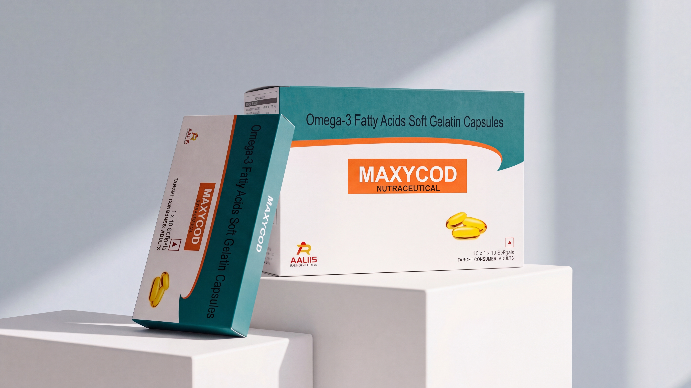

- **Category:** Nutraceutical
- **Dosage form:** Soft Gelatin Capsules
- **Key ingredient:** Pure Fish Oil Concentrate
- **Omega-3:** EPA 360 mg + DHA 240 mg
- **Pack size:** 10 × 1 × 10 Softgels
- **Target consumer:** Adults
- **Marketed by:** Aaliis Pharmaceuticals

---

## 2. Nervlis Plus

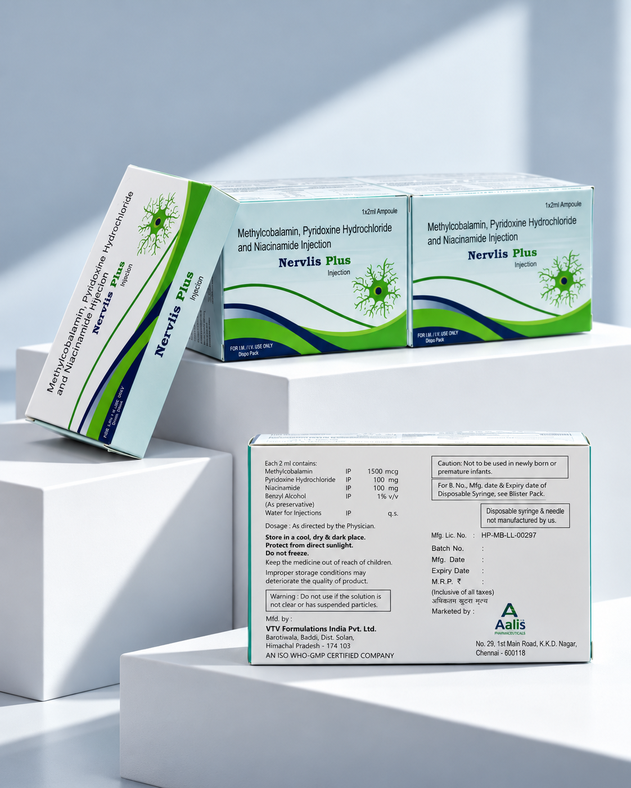

- **Category:** Injection
- **Dosage form:** Injection
- **Pack size:** 1 × 2 mL ampoule

### Composition

- Methylcobalamin — 1500 mcg
- Pyridoxine Hydrochloride — 100 mg
- Nicotinamide — 100 mg
- Benzyl Alcohol — 2% v/v
- Water for Injection — q.s.

- **Marketed by:** Aaliis Pharmaceuticals
- **Manufacturer:** A.V.T Formulations India Pvt. Ltd.

---

## 3. Myozac

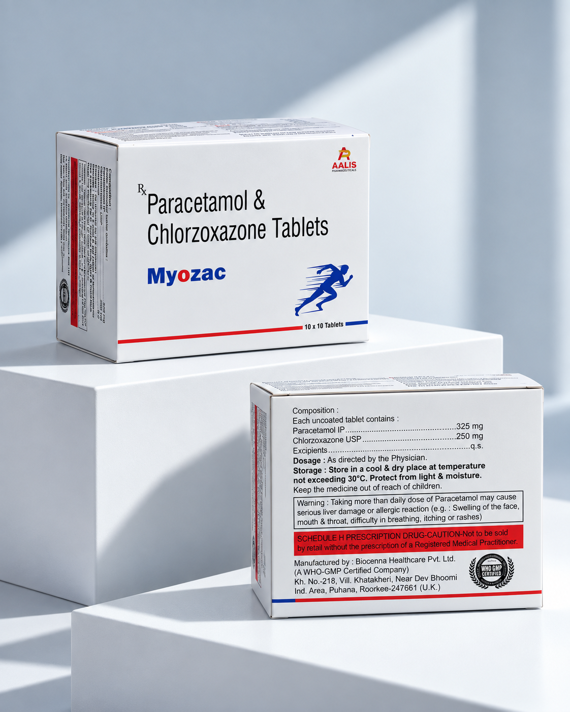

- **Category:** Pain / Musculoskeletal*
- **Dosage form:** Tablet
- **Pack size:** 10 × 10 tablets

### Composition

- Paracetamol IP — 325 mg
- Chlorzoxazone USP — 250 mg

- **Prescription:** Schedule H
- **Manufacturer:** Biocenna Healthcare Pvt. Ltd.
- **Marketed by:** Aaliis Pharmaceuticals

---

## 4. Tryptomec

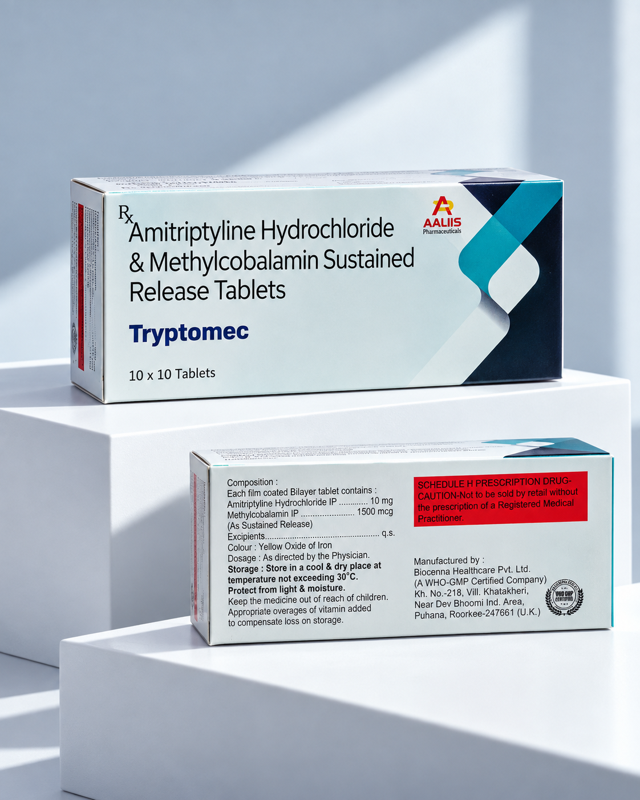

- **Dosage form:** Film-coated bilayer tablet
- **Pack size:** 10 × 10 tablets

### Composition

- Amitriptyline Hydrochloride IP — 10 mg
- Methylcobalamin IP — 1500 mcg (as sustained release)

- **Prescription:** Schedule H
- **Manufacturer:** Biocenna Healthcare Pvt. Ltd.
- **Marketed by:** Aaliis Pharmaceuticals

---

## 5. Regawin 75 M

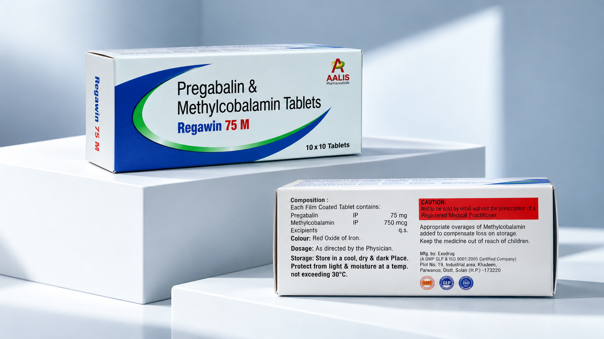

- **Dosage form:** Film-coated tablet
- **Pack size:** 10 × 10 tablets

### Composition

- Pregabalin IP — 75 mg
- Methylcobalamin IP — 750 mcg

- **Manufacturer:** Exodrug
- **Marketed by:** Aaliis Pharmaceuticals
- **Prescription:** Prescription drug

---

## 6. Fluparin-P

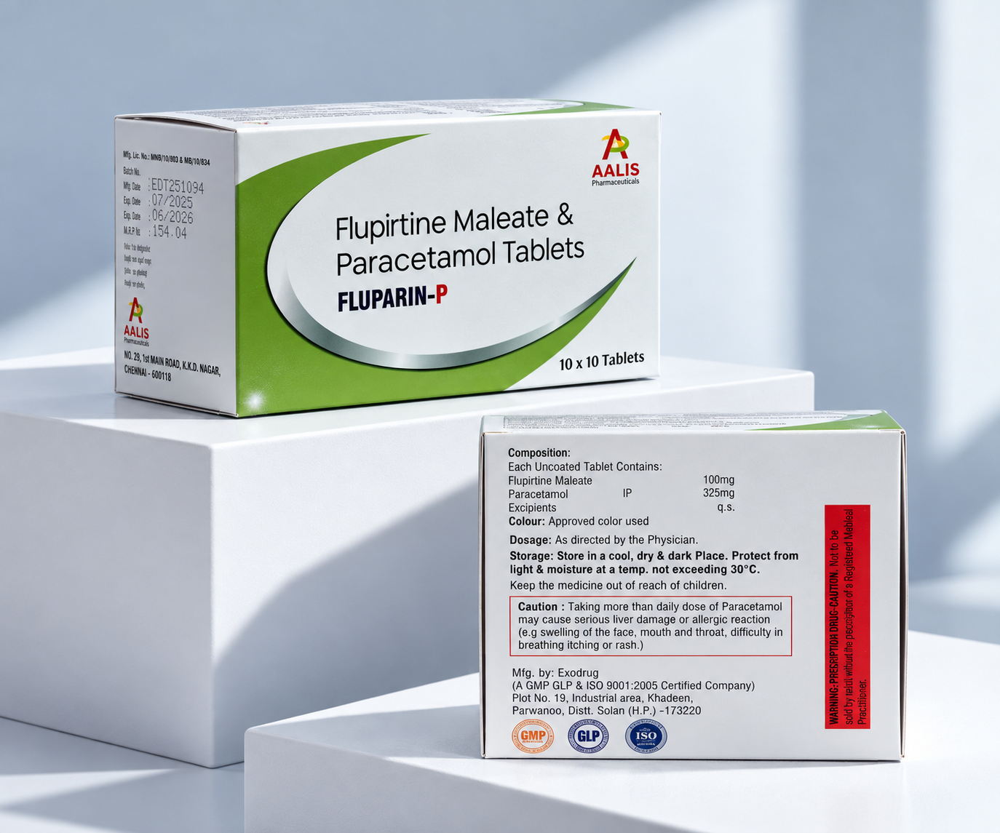

- **Dosage form:** Uncoated tablet
- **Pack size:** 10 × 10 tablets

### Composition

- Flupirtine Maleate — 100 mg
- Paracetamol IP — 325 mg

- **Manufacturer:** Exodrug
- **Marketed by:** Aaliis Pharmaceuticals
- **Prescription:** Prescription drug

---

## 7. ALFROS

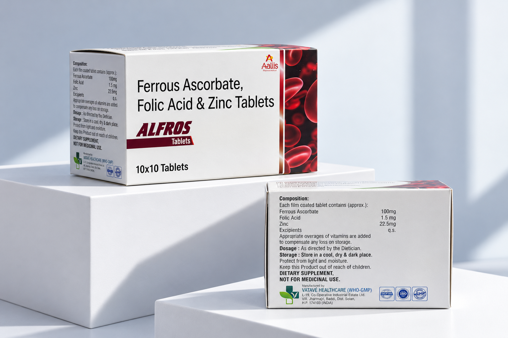

- **Category:** Dietary Supplement
- **Dosage form:** Film-coated tablet
- **Pack size:** 10 × 10 tablets

### Composition

- Ferrous Ascorbate — 100 mg
- Folic Acid — 1.5 mg
- Zinc — 22.5 mg

- **Manufacturer:** Vatatve Healthcare (WHO-GMP)
- **Marketed by:** Aaliis Pharmaceuticals

### Medicinal Classification

**Dietary Supplement — Not for Medicinal Use**

---

## 8. Gladior-P

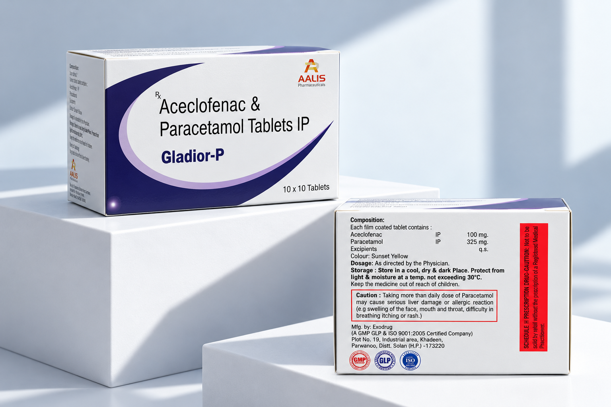

- **Dosage form:** Film-coated tablet
- **Pack size:** 10 × 10 tablets

### Composition

- Aceclofenac IP — 100 mg
- Paracetamol IP — 325 mg

- **Colour:** Sunset Yellow
- **Prescription:** Schedule H
- **Manufacturer:** Exodrug
- **Marketed by:** Aaliis Pharmaceuticals

---

## 9. Regawin-50M

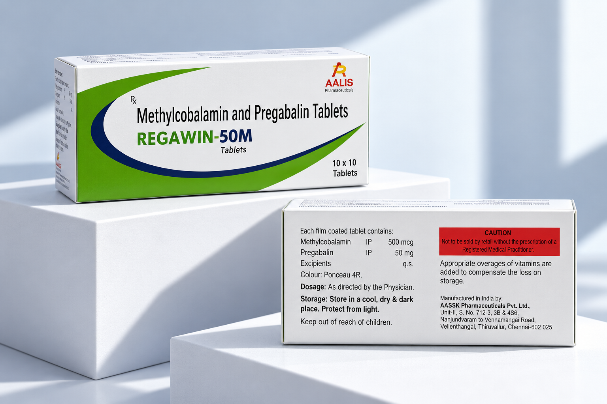

- **Dosage form:** Film-coated tablet
- **Pack size:** 10 × 10 tablets

### Composition

- Methylcobalamin IP — 500 mcg
- Pregabalin IP — 50 mg

- **Colour:** Ponceau 4R
- **Prescription:** Prescription drug
- **Manufacturer:** AASSK Pharmaceuticals Pvt. Ltd.
- **Marketed / Brand owner:** Aaliis Pharmaceuticals

---

## 10. Rabedon-DSR

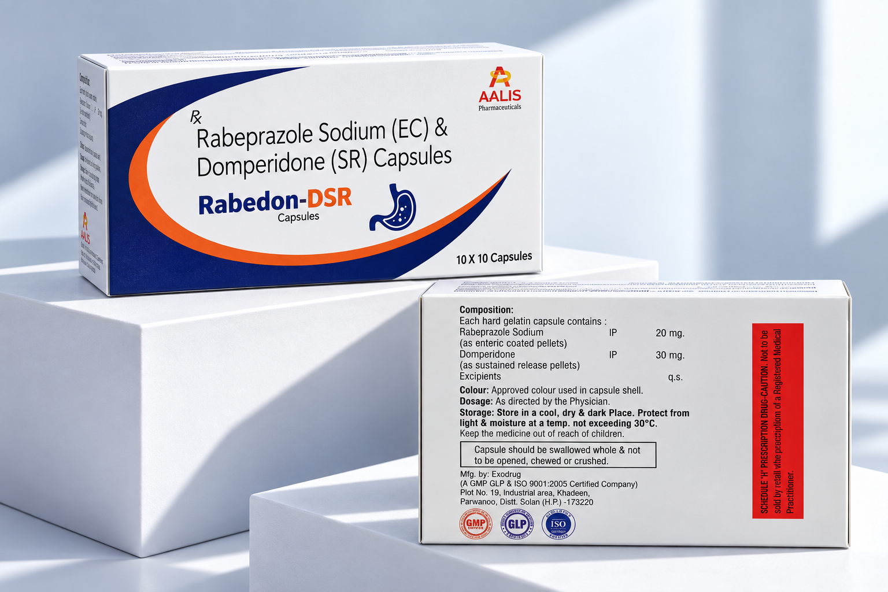

- **Dosage form:** Hard gelatin capsule
- **Pack size:** 10 × 10 capsules

### Composition

- Rabeprazole Sodium IP — 20 mg (as enteric-coated pellets)
- Domperidone IP — 30 mg (as sustained-release pellets)

- **Manufacturer:** Exodrug
- **Marketed by:** Aaliis Pharmaceuticals
- **Prescription:** Schedule H

---

## 11. Biolis-M

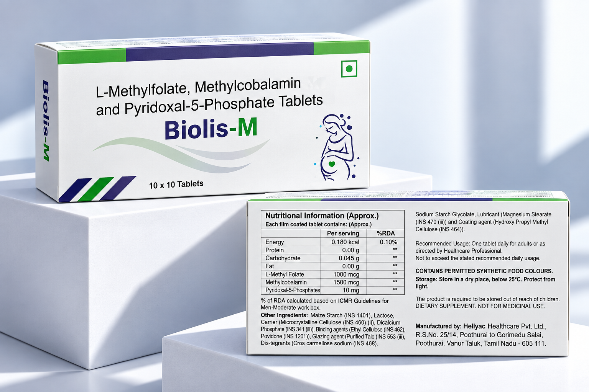

- **Dosage form:** Film-coated tablet
- **Pack size:** 10 × 10 tablets

### Composition

- L-Methyl Folate — 1000 mcg
- Methylcobalamin — 1500 mcg
- Pyridoxal-5-Phosphate — 10 mg

### Recommended Usage

One tablet daily for adults or as directed by healthcare professional.

### Classification

**Dietary Supplement — Not for Medicinal Use**

- **Manufacturer:** Heliyac Healthcare Pvt. Ltd.

---

## 12. Gladior-SP

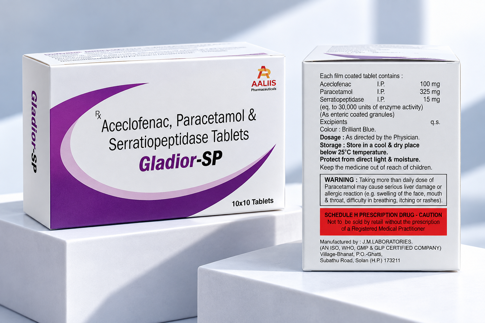

- **Dosage form:** Film-coated tablet
- **Pack size:** 10 × 10 tablets

### Composition

- Aceclofenac IP — 100 mg
- Paracetamol IP — 325 mg
- Serratiopeptidase IP — 15 mg
  - Equivalent to 30,000 units of enzyme activity
  - As enteric-coated granules

- **Colour:** Brilliant Blue
- **Prescription:** Schedule H
- **Manufacturer:** J.M. Laboratories

---

## 13. Panvolis-DSR

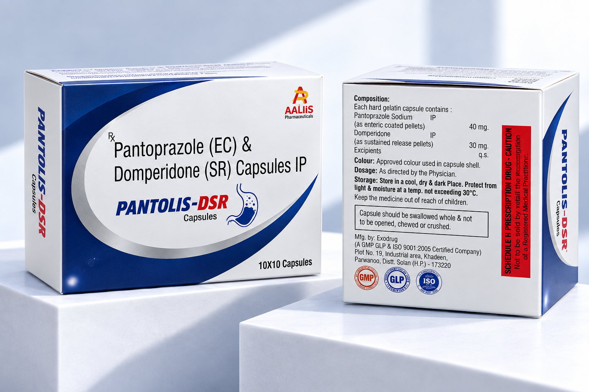

- **Dosage form:** Hard gelatin capsule
- **Pack size:** 10 × 10 capsules

### Composition

- Pantoprazole Sodium IP — 40 mg (as enteric-coated pellets)
- Domperidone IP — 30 mg (as sustained-release pellets)

- **Manufacturer:** Exodrug
- **Prescription:** Schedule H
- **Marketed by:** Aaliis Pharmaceuticals*

---

## 14. Pantolis-40

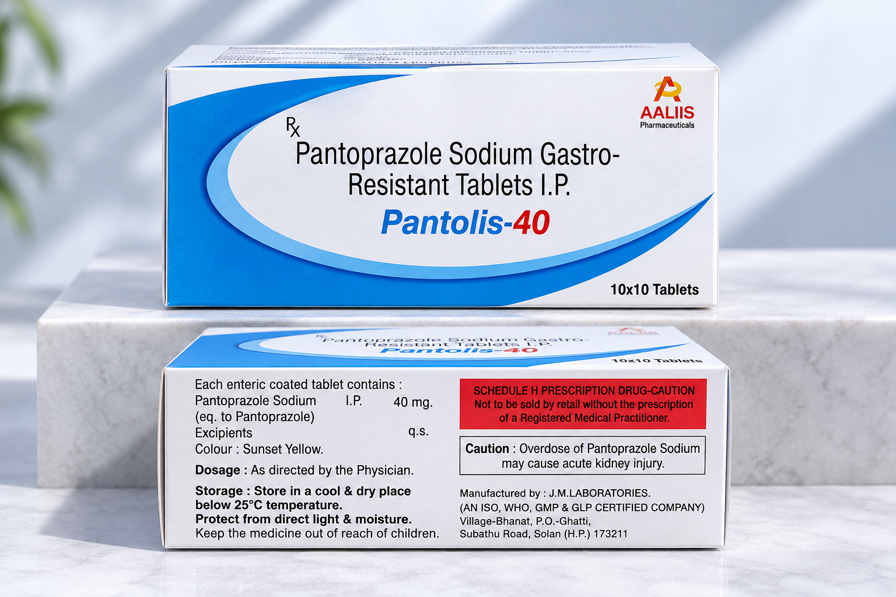

- **Dosage form:** Gastro-resistant / enteric-coated tablet
- **Pack size:** 10 × 10 tablets

### Composition

- Pantoprazole Sodium IP
  - Equivalent to Pantoprazole — 40 mg
- Excipients — q.s.

- **Manufacturer:** J.M. Laboratories
- **Prescription:** Schedule H
- **Colour:** Sunset Yellow

---

## 15. Pregawin-NT

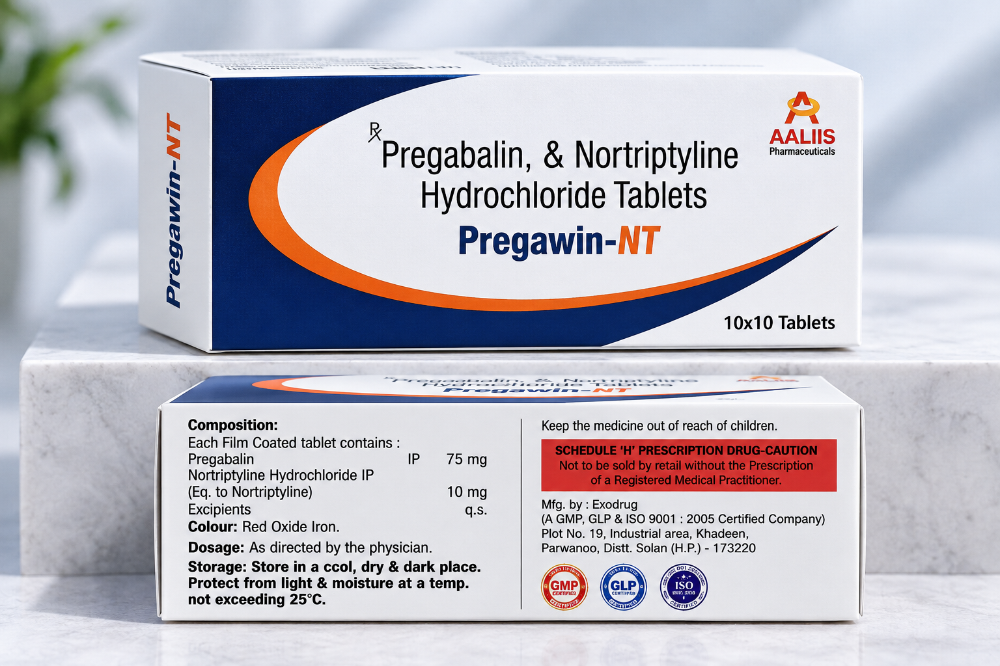

- **Dosage form:** Film-coated tablet
- **Pack size:** 10 × 10 tablets

### Composition

- Pregabalin — 75 mg
- Nortriptyline Hydrochloride — 10 mg
- Excipients — q.s.

- **Colour:** Red Oxide of Iron
- **Prescription:** Schedule H
- **Manufacturer:** Exodrug
- **Storage:** Below 25°C; protect from light & moisture

---

## 16. Etozen-MR

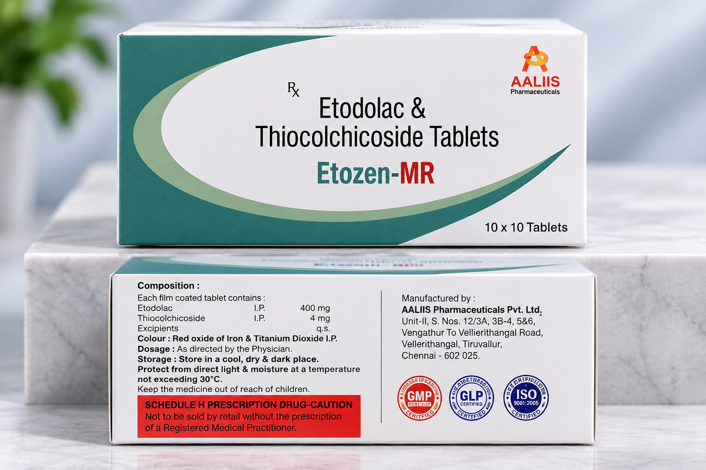

- **Dosage form:** Film-coated tablet
- **Pack size:** 10 × 10 tablets

### Composition

- Etodolac — 400 mg
- Thiocolchicoside IP — 4 mg
- Excipients — q.s.

- **Colours:**
  - Red Oxide of Iron
  - Titanium Dioxide IP

- **Prescription:** Schedule H
- **Manufacturer:** Biocenna Healthcare Pvt. Ltd.
- **Storage:** Below 30°C; protect from light & moisture

---

## 17. ZECAL-D3

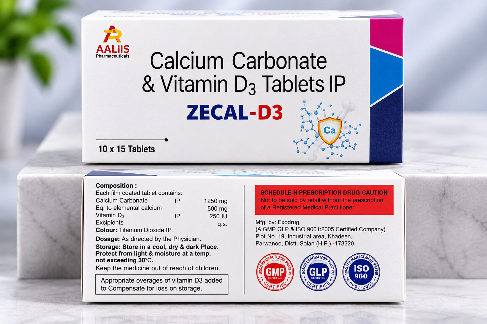

- **Dosage form:** Film-coated tablet
- **Pack size:** 10 × 15 tablets

### Composition

- Calcium Carbonate — 1250 mg
- Equivalent to elemental calcium — 500 mg
- Vitamin D3 — 250 IU
- Excipients — q.s.

- **Colour:** Titanium Dioxide IP
- **Dosage:** As directed by the Physician
- **Storage:** Below 30°C; protect from light & moisture
- **Manufacturer / Marketer shown:** Exodrug

---

## 18. Nervlis

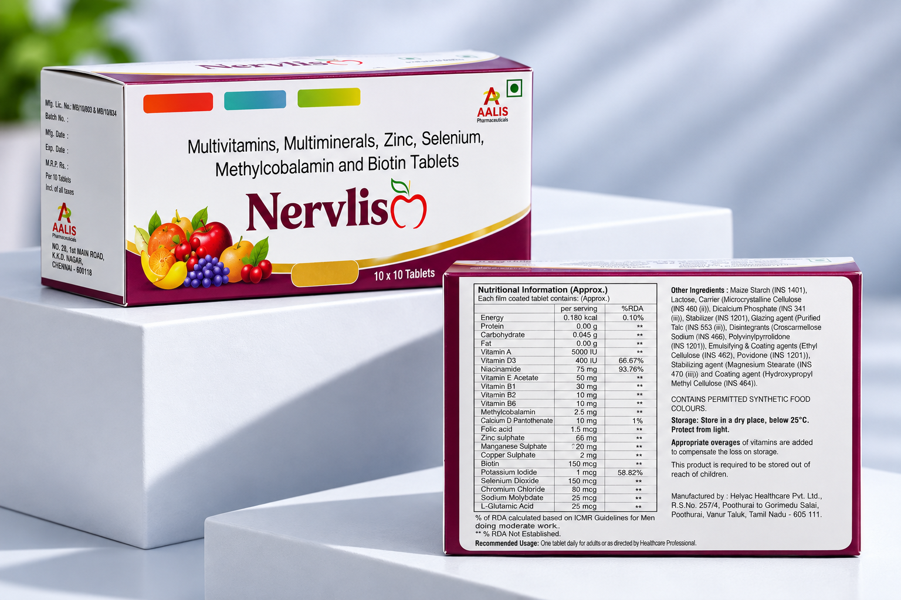

- **Dosage form:** Film-coated tablet
- **Pack size:** 10 × 10 tablets
- **Category:** Dietary Supplement — Not for Medicinal Use

### Composition per Tablet

- Vitamin A — 5000 IU
- Vitamin D3 — 400 IU
- Vitamin C — 75 mg
- Niacinamide — 50 mg
- Vitamin E Acetate — 30 mg
- Vitamin B1 — 10 mg
- Vitamin B2 — 10 mg
- Vitamin B6 — 2.5 mg
- Methylcobalamin — 500 mcg
- Calcium D Pantothenate — 10 mg
- Folic acid — 1.5 mcg
- Zinc sulphate — 66 mg
- Manganese Sulphate — 20 mcg
- Copper Sulphate — 2 mg
- Biotin — 150 mcg
- Potassium Iodide — 1 mcg
- Selenium Dioxide monohydrate — 150 mcg
- Chromium Chloride — 80 mcg
- Sodium Molybdate — 25 mcg
- L-Glutamic Acid — 25 mg

### Recommended Usage

One tablet daily for adults or as directed.

### Storage

Below 25°C; protect from light.

- **Manufacturer:** Heliyac Healthcare Pvt. Ltd.

---

## 19. LEVOMAK-LC

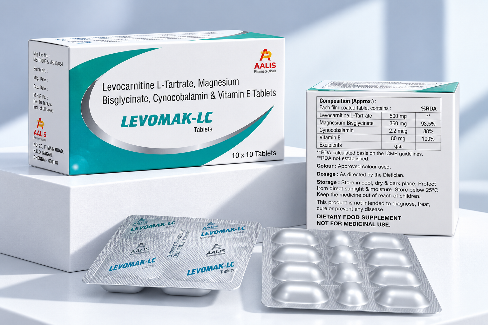

- **Dosage form:** Film-coated tablet
- **Pack size:** 10 × 10 tablets
- **Category:** Dietary Food Supplement — Not for Medicinal Use

### Composition per Tablet

- Levocarnitine L-Tartrate — 500 mg
- Magnesium Bisglycinate — 360 mg
- Cynocobalamin — 2.2 mg
- Vitamin E — 80 mg
- Excipients — q.s.

### Dosage

As directed by the Dietician.

### Storage

Cool, dry & dark place; protect from direct sunlight & moisture; below 25°C.

